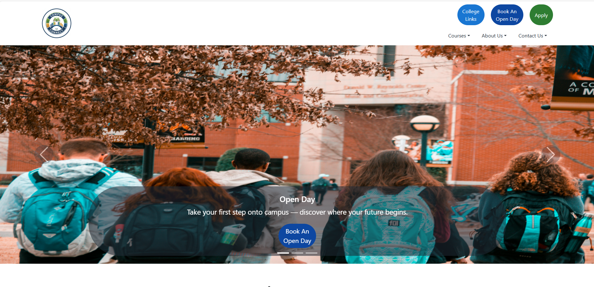
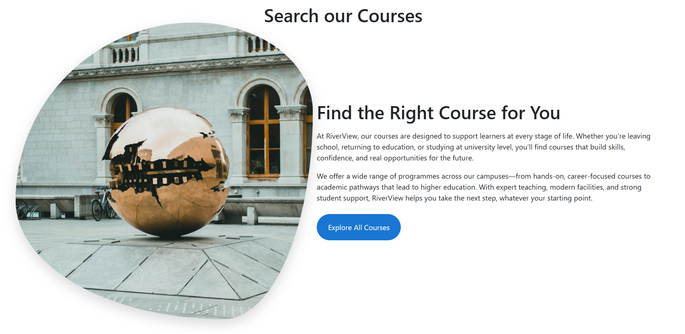
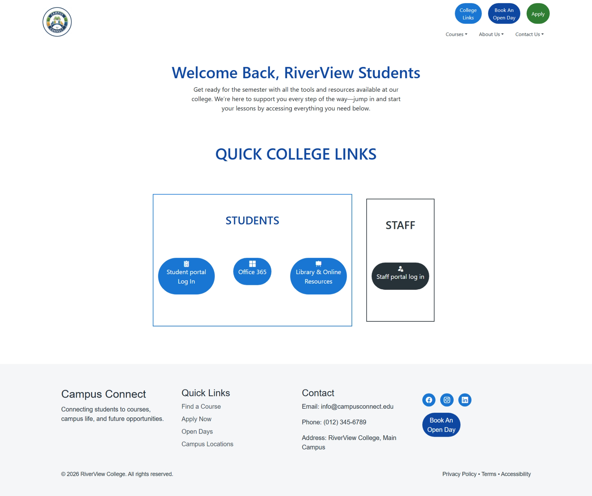
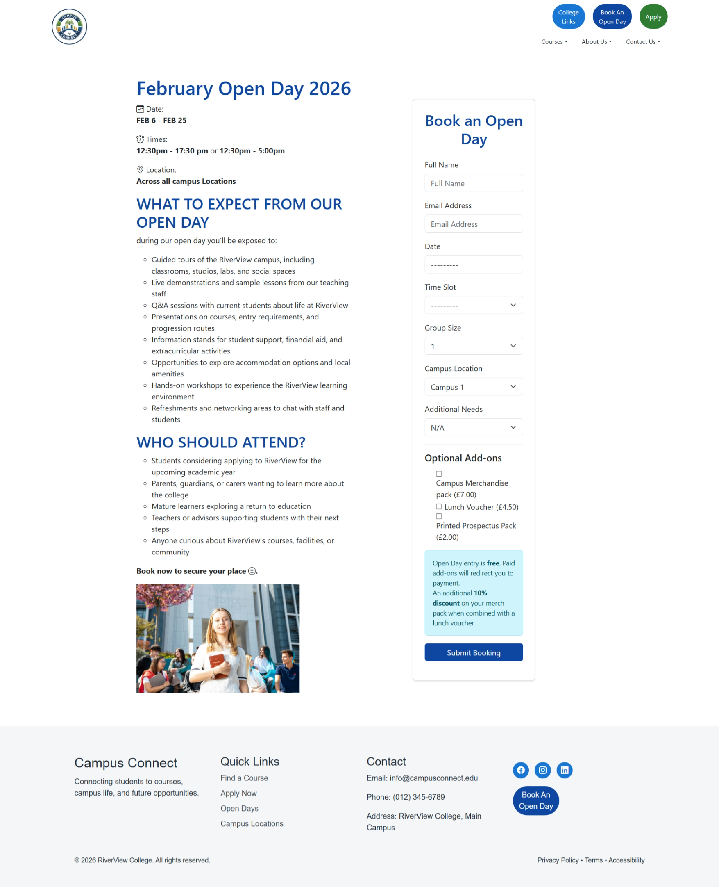
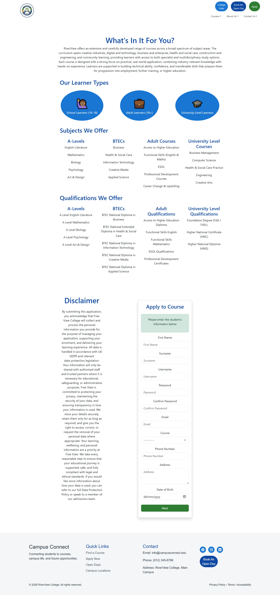
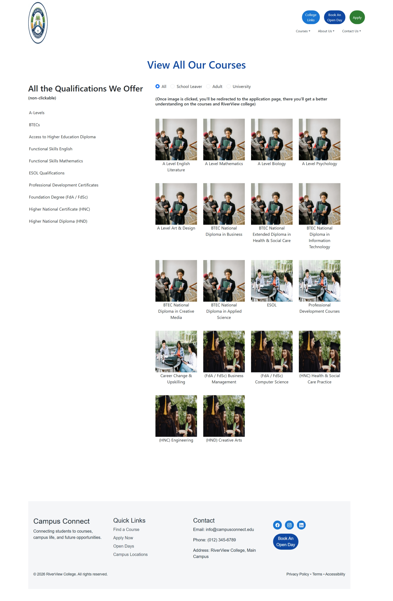
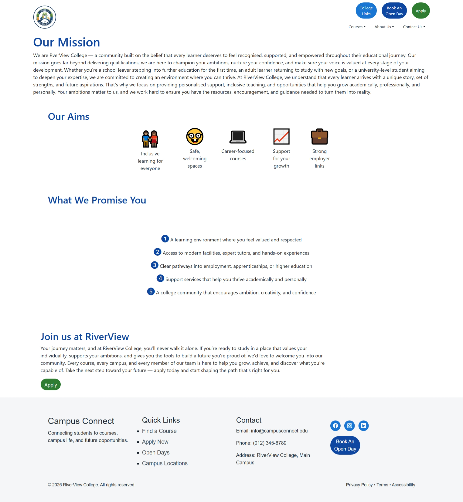
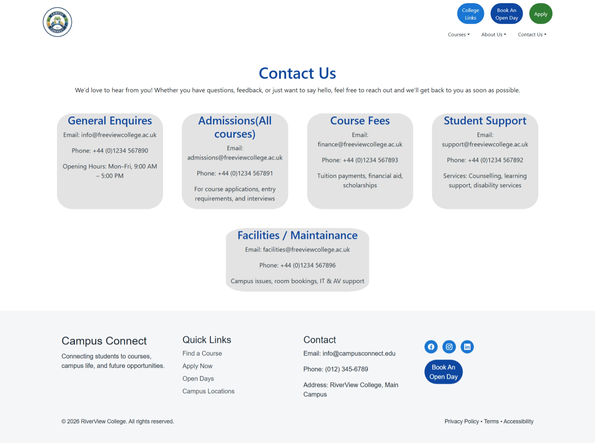
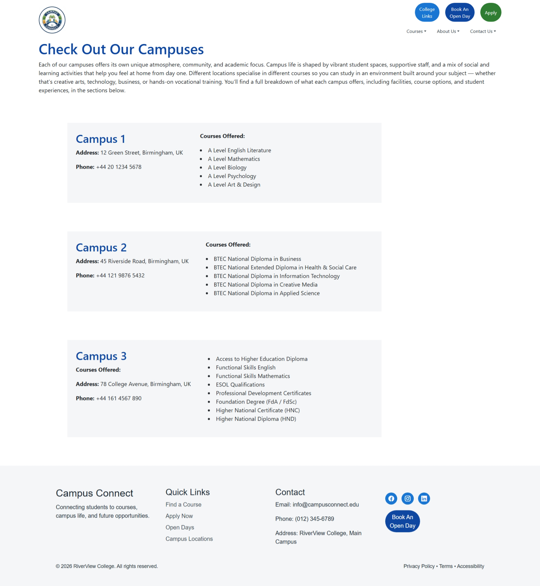

<h1>🚀 CampusConnect – College Open Day Management System</h1>

CampusConnect is a <strong>full-stack web application</strong> designed to streamline the management of college open day events.
This project addresses real-world inefficiencies in booking systems by replacing manual processes with a structured, digital solution.

<h2>📌 Project Overview</h2>

Many institutions rely on <strong>manual workflows</strong> such as forms, spreadsheets, and emails to manage event bookings. 
This often results in:

<ul>
  <li>Duplicate bookings</li>
  <li>Inaccurate visitor tracking</li>
  <li>Missed accessibility requirements</li>
  <li>Staff overbooking for tours</li>
</ul>

<strong>CampusConnect</strong> was developed to centralise and automate this process, improving efficiency, accuracy, and overall user experience.

<h2>⚙️ Features</h2>

<ul>
  <li><strong>🔐 User Authentication:</strong> Secure registration and login system</li>
  <li><strong>📅 Booking Management:</strong> Create, edit, and cancel bookings with enforced business rules</li>
  <li><strong>🧑‍💼 Admin Dashboard:</strong> Manage bookings, schedules, and event data using Django Admin</li>
  <li><strong>🌐 Multi-Page Website:</strong> Structured navigation with course and application pages</li>
  <li><strong>🧠 Business Logic:</strong> Prevents duplicate bookings and enforces scheduling constraints</li>
</ul>

<h2>🛠️ Tech Stack</h2>

<ul>
  <li><strong>Backend:</strong> Django (Python)</li>
  <li><strong>Frontend:</strong> HTML, CSS, Bootstrap</li>
  <li><strong>Database:</strong> SQLite</li>
  <li><strong>Tools:</strong> Git, GitHub</li>
</ul>

<h2>🧠 Key Learning Outcomes</h2>

<ul>
  <li>Translated a real-world problem into a structured digital solution</li>
  <li>Designed database logic to prevent duplication and overbooking</li>
  <li>Applied user-centred design principles for both users and administrators</li>
  <li>Implemented business rules and conditional logic within a web application</li>
  <li>Improved project planning using wireframes, user journeys, and testing scenarios</li>
  <li>Developed awareness of accessibility and safeguarding in system design</li>
</ul>

<h2>🔮 Future Improvements</h2>

<ul>
  <li>Enhance UI/UX for improved usability</li>
  <li>Implement real-time booking availability</li>
  <li>Add stronger validation and error handling</li>
  <li>Integrate secure online payment processing</li>
  <li>Improve scalability for larger events</li>
</ul>

<h2>💡 Summary</h2>

This project demonstrates my ability to build <strong>full-stack applications</strong> that solve practical problems.
It highlights my skills in <strong>web development, system design, and data handling</strong>, with a strong focus on creating
efficient, user-focused solutions.

<h2>🤝 Connect</h2>

If you're working on similar projects or have feedback, feel free to connect!

# 1 Homepage

# 2 Search Courses 

# 3 College links

# 4 Book an open day 

# 5 Apply to courses

# 6 View all courses

# 7 Our mission

# 8 Contact

